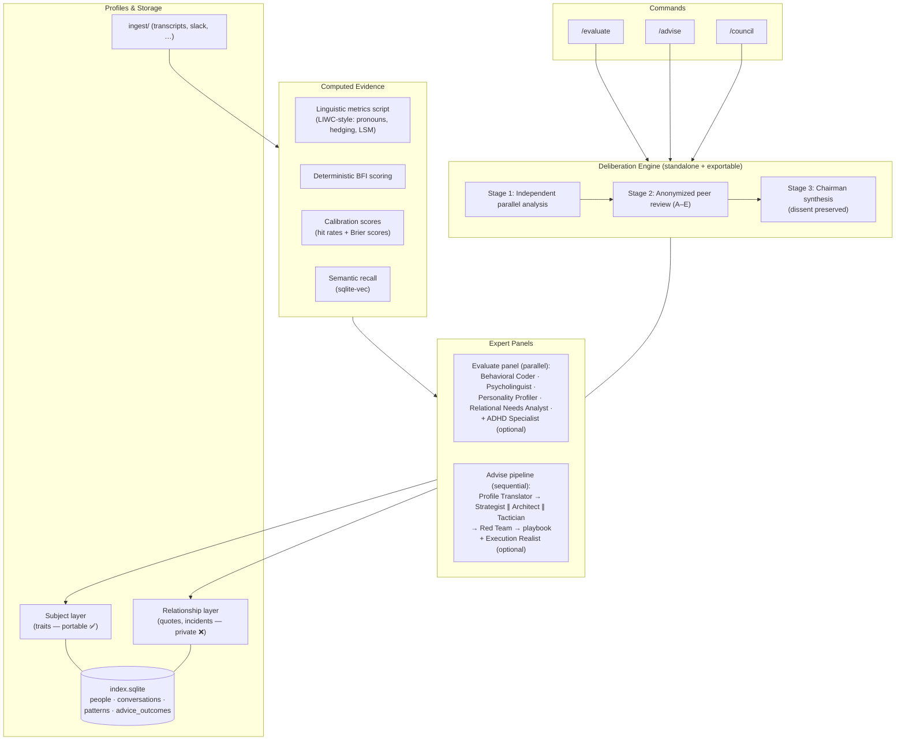
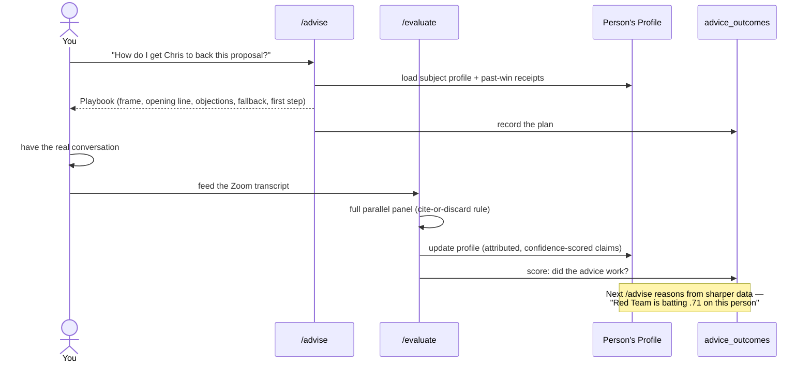

# Parley Voo

> *Parlez-vous?* — to talk things through, especially across a divide.

**Parley Voo is a Claude Code–based personal communication coach.** Councils of expert personas — each grounded in a distinct, named reasoning discipline — evaluate your past conversations and strategize upcoming ones, reasoning from living profiles you build of real people over time. A feedback loop scores whether the advice actually worked, so the system sharpens with use.

> **Status:** 🚧 Planning complete (PRD final, UX in design). Implementation has not started — this README describes the system being built.

---

## Why

Asking one chatbot "how do I handle this conversation?" gets you generic advice from generic stereotypes, delivered by a model that mostly agrees with you. Parley Voo is built to fix both failure modes:

1. **Accumulated, person-specific evidence.** Experts reason from profiles built across real transcripts — computed linguistic metrics, deterministic personality scoring, dated records of what advice actually landed with *this* person. Data nobody can prompt their way to.
2. **Anti-sycophancy by protocol.** Experts analyze independently (never seeing each other's responses), peer-review anonymously, and a chairman synthesis *preserves dissent* — it can side with a strong minority instead of smoothing to consensus.

**Design signature — negative space:** experts are defined by what they *ignore*, coaching by what *not* to do, exports by what is *stripped*.

## What

One deliberation engine, pointed in three directions:

| Command | Direction | Input | Output |
|---|---|---|---|
| `/evaluate` | **Backward** | A conversation transcript | Pattern report + profile updates |
| `/advise` | **Forward** | A goal + a person | A grounded playbook |
| `/council` | **Neutral** | A generic decision | A "should we do X" verdict |

The core loop: run `/advise` before a real conversation → have the conversation → feed the transcript to `/evaluate`, which updates the person's profile **and** scores whether the advice worked. The next `/advise` reasons from the updated profile, past-win receipts, and each expert's batting average.

## Architecture



### The feedback loop



## The Methods

Every expert seat uses a **distinct, named reasoning discipline** — not just a job title. (Same-model panels converge into one opinion unless their reasoning footprints differ — see the [DMAD research](https://openreview.net/forum?id=t6QHYUOQL7) below.) MBTI/Enneagram are barred as scoring engines.

| Seat | Discipline | Learn more |
|---|---|---|
| Behavioral Coder | Gottman method, Functional Behavior Assessment | [Gottman research](https://www.gottman.com/about/research/) · [FBA](https://en.wikipedia.org/wiki/Functional_behavior_assessment) |
| Psycholinguist | Pennebaker-style linguistic analysis (LIWC) | [LIWC](https://www.liwc.app/) · [*The Secret Life of Pronouns*](https://www.secretlifeofpronouns.com/) |
| Personality Profiler | Big Five, item-scores-first (BFI) | [Big Five](https://en.wikipedia.org/wiki/Big_Five_personality_traits) · [BFI-2](https://www.colby.edu/academics/departments-and-programs/psychology/research-opportunities/personality-lab/the-bfi-2/) |
| Relational Needs Analyst | Attachment theory, NVC, Transactional Analysis | [Attachment](https://en.wikipedia.org/wiki/Attachment_theory) · [NVC](https://www.cnvc.org/) · [TA](https://en.wikipedia.org/wiki/Transactional_analysis) |
| ADHD Specialist *(optional)* | Executive function, rejection-sensitive dysphoria | [RSD overview](https://www.additudemag.com/rejection-sensitive-dysphoria-adhd-emotional-dysregulation/) |
| Red Team / calibration | Forecast scoring | [Brier score](https://en.wikipedia.org/wiki/Brier_score) |

**Engine lineage:** adapted from [`ngmeyer/council-review`](https://github.com/ngmeyer/council-review), itself built on [Karpathy's LLM Council](https://github.com/karpathy/llm-council) and the DMAD multi-agent-debate research (ICLR 2025). Key inherited principle: independence first — majority pressure can suppress correct minority views, so debate only where it earns its token cost.

## Usage

> 🚧 Placeholders — commands land as the epics ship.

```bash
# Coach an upcoming conversation
/advise "Get Chris to back the Q3 proposal" --person chris

# Analyze a conversation that already happened (full panel, always)
/evaluate ingest/transcripts/2026-06-04-chris-1on1.txt

# Generic decision, no person involved (off-the-shelf engine)
/council "Should we switch the team to trunk-based development?"

# Share a profile — subject layer only, relationship layer stripped
/export-profile chris              # Named (default)
/export-profile chris --archetype  # anonymized, public-safe

# Ingest someone else's read — provenance-tagged, never blended with yours
/import-profile their-chris.md
```

**Cost tiers:** quick mode (fewer experts, no peer review) is the default for `/advise` and `/council`; pass a full-mode flag to escalate. `/evaluate` always runs the full panel.

## Privacy & Responsible Use

This tool exists to improve **your own** communication — not to covertly profile others.

- **Profiles are interpretation, not fact.** Every claim is attributed, provisional, and confidence-scored. An exported profile is headed as a *starting hypothesis, not a verdict*.
- **Two layers, split at storage time.** The subject layer (traits, what framing lands) is portable; the relationship layer (real quotes, incidents, outcome history) is private and never exported.
- **Mutual-benefit influence only.** The bar: you'd be comfortable if the subject found out you *used* the tactic — not merely if they read the playbook.
- **Use discretion around mutual contacts.** Archetype export is the default-safe level for anything public.
- **A clean fork contains zero private data.** `people/`, `transcripts/`, and `index.sqlite` are gitignored; `scripts/verify-clean-fork` confirms it.

## Project Status & Docs

| Artifact | Where |
|---|---|
| Project spec | [`docs/parley-spec.md`](docs/parley-spec.md) |
| PRD (FR1–32, final) | [`_bmad-output/planning-artifacts/prds/prd-parley_voo-2026-06-04/prd.md`](_bmad-output/planning-artifacts/prds/prd-parley_voo-2026-06-04/prd.md) |
| UX design (in progress) | [`_bmad-output/planning-artifacts/ux-designs/`](_bmad-output/planning-artifacts/ux-designs/) |

**Roadmap (V1 epics):** repo scaffold → deliberation engine → expert panel → persona management → data model & storage → `/evaluate` → `/advise` → `/council` → feedback loop → profile sharing → distribution polish.

**Later (V2):** ride-along copilot (live in-conversation coaching), Claude Project export, graph DB (only if joins get ugly).

## Contributing

> 🚧 Placeholder — contribution flow firms up once the scaffold ships.

1. **Fork clean.** A fresh clone ships the engine, commands, schema, and archetype example profiles — zero private data. Run `scripts/verify-clean-fork` to confirm.
2. **Never commit the private layer.** `people/`, `transcripts/`, and `index.sqlite` stay gitignored. PRs touching `.gitignore` get extra scrutiny.
3. **New expert personas** must use a distinct, *named* reasoning method (see [The Methods](#the-methods)) — distinct job titles aren't enough, and MBTI/Enneagram don't qualify as scoring engines.
4. **Share archetypes, not people.** Example profiles in `examples/` use Archetype sanitization ("the skeptical-analytical stakeholder") — never named real people.
5. Open an issue before large changes; the PRD ([FR1–32](_bmad-output/planning-artifacts/prds/prd-parley_voo-2026-06-04/prd.md)) is the source of truth for scope.

## License

TBD.
